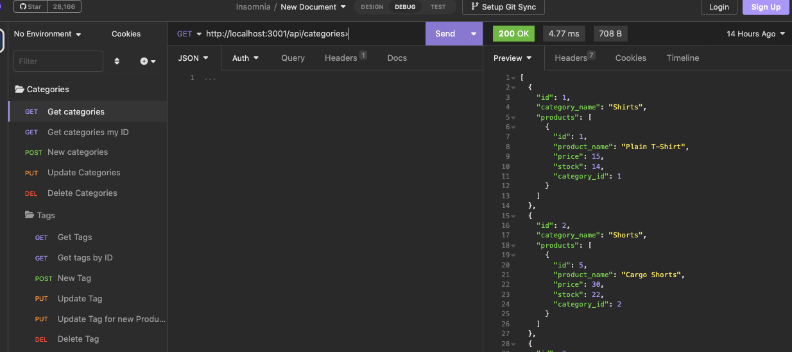
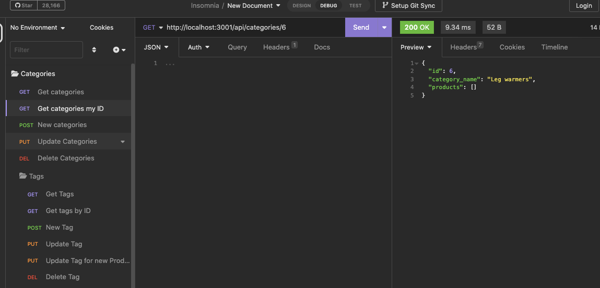
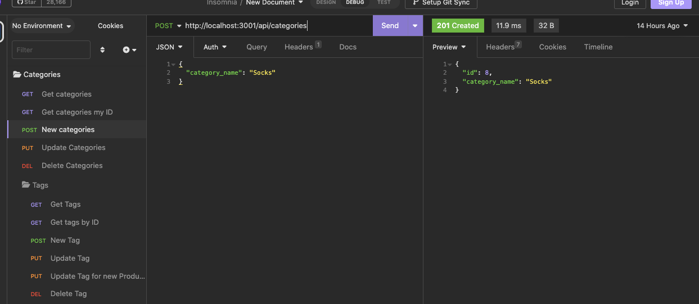
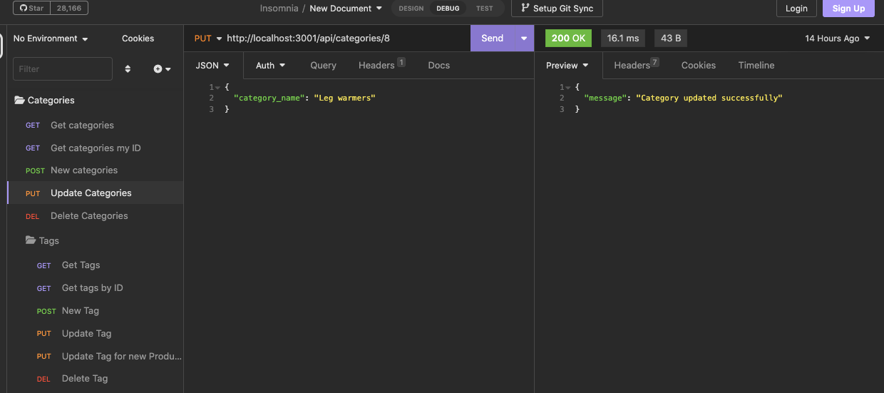
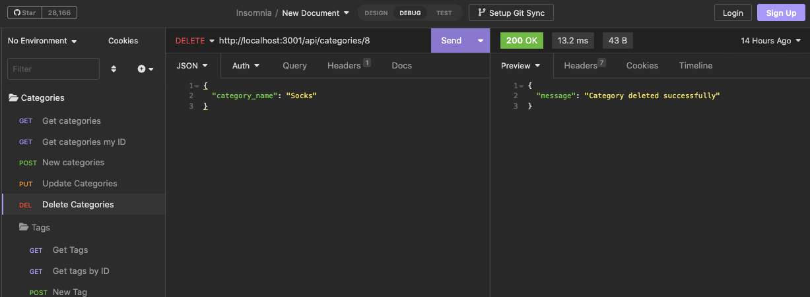

# E-Store Product management backend
  
  
## [License](#license)

No license was used for this project.

  ## [Description](#table-of-contents)
  
  For this projuct, I was tasked with compleating the API routes for an E-Store Product management backend that can be used to add, remove, or update the Products, Tags, or Categories. I was also tasked to complete the DB Models
  
  
  ## Table of Contents
  
  - [Description](#discription)
  - [Installation](#installation)
  - [Usage](#usage)
  - [Credits](#credits)
  
  - [Tests](#tests)
  - [License](#license)
  - [Questions](#questions)
  
  ## [Installation](#table-of-contents)
  
  After cloning the repository into your local directory, open it in your markdown editor of choice and in the terminal run `npm I` this will install all of the dependencies needed. Next you will need to copy the .env example in the route directories and name it `.env`, fill out the username and password of your choice and then run in the terminal `mysql -u -p` with your credentials. Next you’ll run `source mySQL/schema.sql;` to initialize the database and then to populate it with data use `quit` to get out of mySQL and in the terminal run `npm run seed`
    
  ## [Usage](#table-of-contents)
  
  Run `NPM start` in the terminal to start the server and then open Insomnia, from there you can test the API routes from `http://localhost:3001/api/categories` 

  
  
  you can start with the `GET` `POST` `PUT` `DELETE` options and replace `categories` with any of the fallowing. 
  
  `http://localhost:3001/api/categories/:id` (replace :id with the actual ID) 

  
  
  `http://localhost:3001/api/categories` 

  
  
  `http://localhost:3001/api/categories/:id` (replace :id with the actual ID) 

  
  
  `http://localhost:3001/api/products/:id` (replace :id with the actual ID) 

  

  Check out the install and usage video [Here](https://drive.google.com/file/d/1I-Phf5fjw9jRwlfv4tAEGGKQGP4WCT-y/view) for more Route options!.

  
  ## [credits](#table-of-contents)
  
  N/A

  Thank you for your interest in helping out; however, I will not be accepting contributions from third parties.
  

  

  ## [Tests](#table-of-contents)

  N/A

  ## [Questions](#table-of-contents)

  Please contact me using the following links:
  [GitHub](https://github.com/philippwinston)
  [Email: philippwinston@gmail.com](mailto:philippwinston@gmail.com)
  
---
